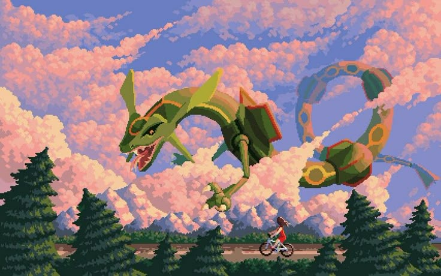
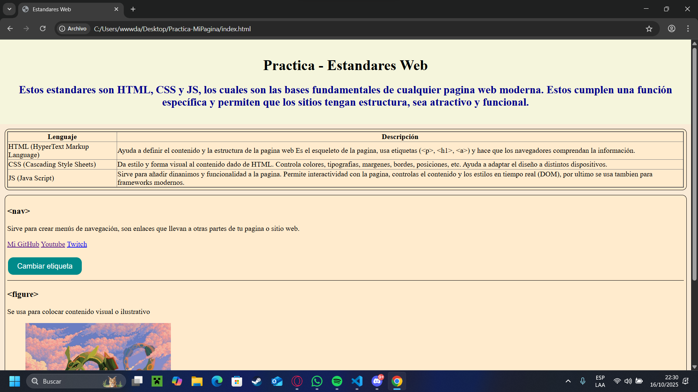
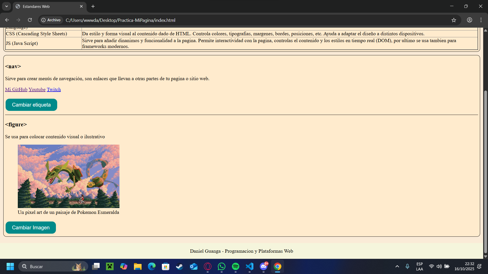

# Programación y Plataformas Web (PPW)

---

#  Práctica 1 – Explorando los Estándares Web con HTML, CSS y JavaScript

**Asignatura:** Programación y Plataformas Web  
**Unidad:** 1.2 – Estándares Web  
**Estudiante:** Daniel Guanga
**Repositorio:** [https://github.com/Pangust-code/icc-ppw-u1-mi_pagina_web](https://github.com/Pangust-code/icc-ppw-u1-mi_pagina_web)  
**Página desplegada (GitHub Pages):** [https://pangust-code.github.io/icc-ppw-u1-mi_pagina_web/](https://pangust-code.github.io/icc-ppw-u1-mi_pagina_web/)  

---

## 🧱 Estructura HTML utilizada

| Componente | Descripción | Implementación |
|-------------|--------------|----------------|
| `<!DOCTYPE html>` | Declaración del documento HTML5 | Línea 1 |
| `<html lang="es">` | Idioma del documento | Español |
| `<header>` | Encabezado principal | Contiene `<h1>` y `<h2>` |
| `<section>` | Agrupa contenido principal | Dos secciones con `<h2>` |
| `<table>` | Muestra los elementos estudiados | Tres filas con `<th>` y `<td>` |
| `<footer>` | Pie de página | Nombre del estudiante y asignatura |

---

## 🧩 Nuevas etiquetas exploradas

| Etiqueta | Descripción | Implementación |
|-----------|--------------|----------------|
| `<figure>` | Contenedor para imagen con pie de foto | Logo HTML5 con `<figcaption>` |
| `<nav>` | Crear menús de navegación | Enlaces que llevan a otras partes de tu pagina web |
| `<div>` | Agrupa contenido en bloques | Da estilos y posiciona la pagina |

**Código usado:**
```html
        <h3 id="nomEtiqueta">&lt;nav&gt;</h3>
        <p id="descEtiqueta">Sirve para crear menús de navegación, son enlaces que llevan a otras
            partes de tu pagina o sitio web.
        </p>
        <nav id="navegador">
            <a href="https://github.com/Pangust-code" target="_blank">Mi GitHub</a>
            <a href="https://www.youtube.com" target="_blank">Youtube</a>
            <a href="https://www.twitch.tv" target="_blank">Twitch</a>
        </nav>

        <div id="contenedor" class="divContenedor"></div>

        <h3>&lt;figure&gt;</h3>
        <p>Se usa para colocar contenido visual o ilustrativo</p>
        <figure>
            
            <figcaption id="description">Un pixel art de un paisaje de Pokemon Esmeralda</figcaption>
        </figure>
```


---

#  Práctica 2 – Adición de CSS y JavaScript
---

### 1. Archivos agregados

| Archivo     | Descripción                                                                                         | Ubicación                 |
| ----------- | --------------------------------------------------------------------------------------------------- | ------------------------- |
| `style.css` | Contiene todos los estilos visuales del sitio (colores, tipografía, márgenes, botones, tabla, etc.) | Carpeta raíz del proyecto |
| `script.js` | Contiene las funciones y eventos JavaScript que agregan comportamiento dinámico                     | Carpeta raíz del proyecto |

Estructura final del proyecto:

```
icc-ppw-u1-mi_pagina_web/
│
├── index.html
├── style.css
├── script.js
└── README.md
```

 * CAMBIAR SEGUN SU ESTRUCTURA

---

### 2. Implementación en HTML

Los nuevos archivos se enlazaron dentro del documento `index.html` de la siguiente forma:

**En el `<head>` (para el CSS):**

```html
    <header>
        <h1>Practica - Estandares Web</h1>
        <h2>Estos estandares son HTML, CSS y JS, los cuales son las bases
           fundamentales de cualquier pagina web moderna. Estos cumplen
           una función específica y permiten que los sitios tengan estructura,
           sea atractivo y funcional. 
        </h2>
    </header>
```

**Antes de cerrar el `<body>` (para el JavaScript):**

```html
<body>
    <header>
        <h1>Practica - Estandares Web</h1>
        <h2>Estos estandares son HTML, CSS y JS, los cuales son las bases
           fundamentales de cualquier pagina web moderna. Estos cumplen
           una función específica y permiten que los sitios tengan estructura,
           sea atractivo y funcional. 
        </h2>
    </header>

    <section>
        <table border="2">
            <thead>
            <tr>
                <th>Lenguaje</th>
                <th>Descripción</th>
            </tr>
            </thead>
            <tbody>
                <tr>
                    <td>HTML (HyperText Markup Language)</td>
                    <td>Ayuda a definir el contenido y la estructura de la pagina web
                        Es el esqueleto de la pagina, usa etiquetas (&lt;p&gt;, &lt;h1&gt;, &lt;a&gt;)
                        y hace que los navegadores comprendan la información.
                    </td>
                </tr>
                <tr>
                    <td>CSS (Cascading Style Sheets)</td>
                    <td>Da estilo y forma visual al contenido dado de HTML.
                        Controla colores, tipografias, margenes, bordes, posiciones, etc.
                        Ayuda a adaptar el diseño a distintos dispositivos.
                    </td>
                </tr>
                <tr>
                    <td>JS (Java Script)</td>
                    <td>Sirve para añadir dinanimos y funcionalidad a la pagina.
                        Permite interactividad con la pagina, controlas el contenido
                        y los estilos en tiempo real (DOM), por ultimo se usa tambien para frameworks modernos.
                    </td>
                </tr>
            </tbody>
        </table>
    </section>

    <section>
        <h3 id="nomEtiqueta">&lt;nav&gt;</h3>
        <p id="descEtiqueta">Sirve para crear menús de navegación, son enlaces que llevan a otras
            partes de tu pagina o sitio web.
        </p>
        <nav id="navegador">
            <a href="https://github.com/Pangust-code" target="_blank">Mi GitHub</a>
            <a href="https://www.youtube.com" target="_blank">Youtube</a>
            <a href="https://www.twitch.tv" target="_blank">Twitch</a>
        </nav>

        <div id="contenedor" class="divContenedor"></div>

        <button id="btn1" class="btnCambiarEtiqueta" onclick="cambiarEtiqueta()">Cambiar etiqueta</button>

        <hr>

        <h3>&lt;figure&gt;</h3>
        <p>Se usa para colocar contenido visual o ilustrativo</p>
        <figure>
            
            <figcaption id="description">Un pixel art de un paisaje de Pokemon Esmeralda</figcaption>
        </figure>

        <button id="btn2" class="btnCambiarImagen" onclick="cambiarImagen()">Cambiar Imagen</button>

        <script src="script.js"></script>
    </section>

    <footer>
        Daniel Guanga - Programacion y Plataformas Web
    </footer>


</body>
```

---

### 3. Estilos aplicados con CSS

* COMLETAR LA TABLA

| Elemento                    | Estilo implementado                                            | Descripción                             |
| --------------------------- | -------------------------------------------------------------- | --------------------------------------- |
| `body`                      | `background-color: antiquewhite; margin: 0; padding: 0;`       | Personalizacion del cuerpo del html     |
| `header`                    | `background-color: beige; color: darkblue; padding: 1rem 0; text-align: center;` | Personalizacion del encabezado del html |
| `table`                     | `border-collapse: collapse; border = "2";`                      | Personalizacion de la tabla             |
| `button`                    | `background-color: rgb(0, 138, 138); color: white; border: none; padding: 10px 20px; text-align: center text-decoration: none; display: inline-block; font-size: 16px; margin: 4px 2px; cursor: pointer; border-radius: 12px;`| Personalizacion de los botones|
| `section`                   | `background-color: blanchedalmond; padding: 5px; margin: 10px; border-radius: 10px; margin-bottom: 5px; border: 1px solid black;`             | Personalizacion de la seccion html      |
| `hr`                        | `border: none; background-color: black; height: 1px;` | Personalizacion del separador|
| `footer`                    | `background-color: beige; text-align: center; padding: 1rem 0; margin-top: 20px;` | Personalizacion del pie de pagina |
| `h1`                        | `color: black;` | Personalizacion del titulo|


**Ejemplo en el código:** 

AGREGAR DOS EJEMPLOS DE SU CODIGO CSS

```css
        body {
            background-color: antiquewhite;
            margin: 0;
            padding: 0;
        }

        header {
            background-color: beige;
            color: darkblue;
            padding: 1rem 0;
            text-align: center;
        }
```

---

###  4. Interactividad agregada con JavaScript

El archivo `script.js` incorpora dos acciones básicas:

1. **Agregar contenido al div al presionar el botón**

   ```javascript
    function cambiarEtiqueta() {
        const contenedor = document.getElementById('contenedor');
        const nomEtiqueta = document.getElementById('nomEtiqueta');
        const descEtiqueta = document.getElementById('descEtiqueta');
        const boton = document.getElementById('btn1');
        const navegador = document.getElementById('navegador');

        if (nomEtiqueta.textContent === '<nav>') {
            nomEtiqueta.textContent = '<div>';
            descEtiqueta.textContent = 'Sirve para agrupar contenido en bloques, puedes darle estilos y posicionarlo en la pagina.';
            navegador.innerHTML = "";
            contenedor.innerHTML = `<h2>Mis pasatiempos</h2>
                                    <p>Mi juego sandbox favorito es Terraria, me gusta explorar y derrotar a los variados jefes que tiene el juego.</p>
                                    <ul>
                                        <li><a href="https://store.steampowered.com/app/105600/Terraria/?l=spanish" target="_blank">Terraria</a></li>
                                    </ul>
                                    <p>Mi musica favorita es el rock, una de mis bandas favoritas es Mago de Oz.</p>
                                    <ul>
                                        <li><a href="https://www.youtube.com/channel/UC6nMOIbArzvza6npl0irIWw" target="_blank">Mago de Oz</a></li>
                                        <li><a href="https://www.youtube.com/watch?v=5BiwcWDlW7k&list=RD5BiwcWDlW7k&start_radio=1" target="_blank">Mi cancion favorita de la banda</a></li>
                                    </ul>`;
            contenedor.style.padding = "10px";
            contenedor.style.border = "1px solid black";
            contenedor.style.backgroundColor = "#ffffe0";
            contenedor.style.borderRadius = "8px";
        }else {
            nomEtiqueta.textContent = '<nav>';
            descEtiqueta.textContent = 'Sirve para crear menús de navegación, son enlaces que llevan a otras partes de tu pagina o sitio web.';
            contenedor.innerHTML = "";
            navegador.innerHTML = `<a href="https://github.com/Pangust-code" target="_blank">Mi GitHub</a>
                                    <a href="https://www.youtube.com" target="_blank">Youtube</a>
                                    <a href="https://www.twitch.tv" target="_blank">Twitch</a>`;
            contenedor.style.padding = "0"; 
            contenedor.style.border = "none";
            contenedor.style.backgroundColor = "transparent";
            contenedor.style.borderRadius = "0";
        }

        setTimeout(() => {
            boton.style.backgroundColor = '#008b8b';
        }, 100);
  }

  ```

2. **Cambiar la imagen al presionar el botón**

   ```javascript
  function cambiarImagen() {
    const imagen = document.getElementById('img');
    const descripcion = document.getElementById('description');
    const boton = document.getElementById('btn2');
    if (imagen.src.includes('pokemon.jpg')) {
        imagen.src = 'Zelda.gif'; 
        imagen.alt = 'Zelda';
        descripcion.textContent = 'Un gif pixel art de un paisaje de Zelda: Ocarina of Time';
        boton.style.backgroundColor = '#add8e6';
    } else {
        imagen.src = 'pokemon.jpg'; 
        imagen.alt = 'Pokemon';
        descripcion.textContent = 'Un pixel art de un paisaje de Pokemon Esmeralda';
        boton.style.backgroundColor = '#add8e6';
    }
    setTimeout(() => {
        boton.style.backgroundColor = '#008b8b';
    }, 100);
  }
   ```

3. **Cambiar color al titulo al presionar el botón**

```javascript
document.addEventListener("DOMContentLoaded", () => {
    // Efecto al pasar el mouse por el título
    const titulo = document.getElementById("titulo");
    if (titulo) {
        const originalColor = window.getComputedStyle(titulo).color;
        titulo.addEventListener("mouseover", () => {
            titulo.style.color = "rgb(119, 237, 16)";
        });
        titulo.addEventListener("mouseout", () => {
            titulo.style.color = originalColor || "";
        });
    }
});
```

## Capturas de pantalla del proyecto final

* Agregar su captura de pantalla del proyecto final funcionando en el navegador, de ambas versiones (sin y con CSS/JS)




